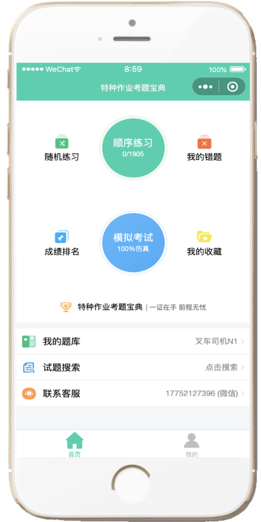
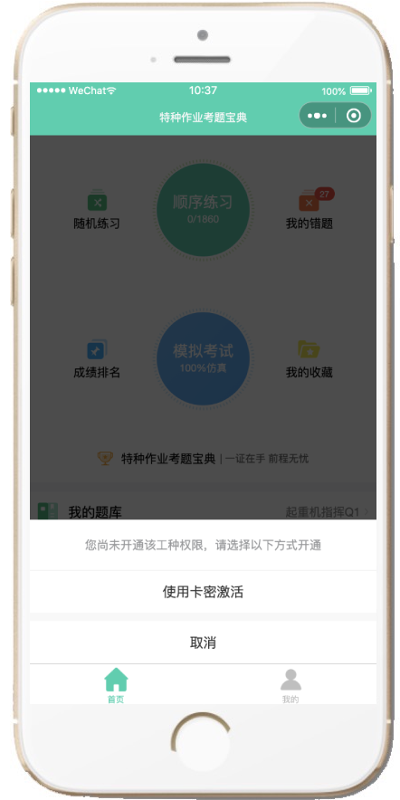
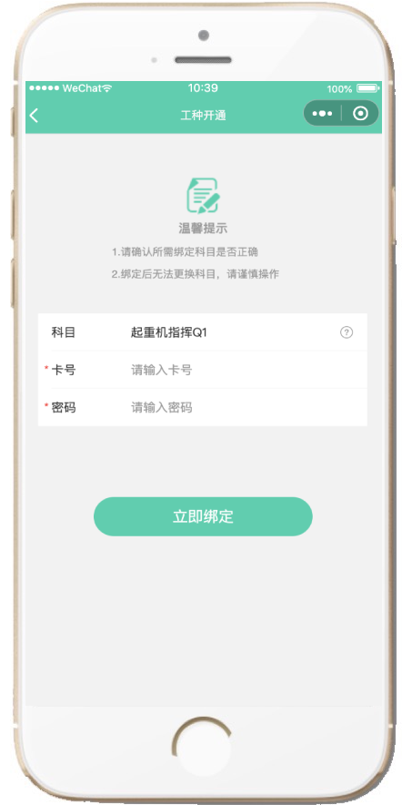
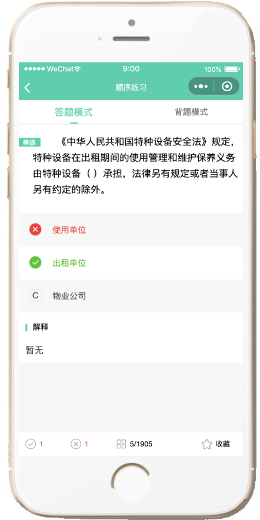

# 在线刷题考试系统 pc端移动端，多端做题记录实时同步（支持微信登录+用户密码登录两种方式）

#### 提示：此源码仅仅是考试系统后台接口地址一部分，非整个考试系统源码，有需要直接可以联系我奥，可以共同讨论。非喜勿喷，谢谢！

#### 联系微信

 

#### 联系QQ（搜索：153768392）

#### 功能介绍
#### v3.0最新版功能介绍
     1.新增微信小程序端刷题功能，支持微信小程序+电脑端刷题需求，多端刷题记录实时同步；
     2.新增微信小程序端游客自行激活题库(通过授权码激活、微信在线支付激活敬请期待)；
     3.优化试题大并发加载速度，通过多种缓存方式解决试题试题加载及实时刷题速度；
     4.支持类SAAS模式，可开通子学校、子培训机构或子管理员，让其入驻使用；

#### 适用机构场景：
     在线考试系统适用于企业考核、员工职评测、培训机构考证刷题等场景；

#### 用户端功能：
     【网站首页信息】、【题库】、【顺序练习】【随机练习】，【真题模拟】，【我的错题】，【我的收藏】、【视频课程】、【题目搜索】、【考试记录】、【我的证书】、【错题重练(答对自动移除错题)】、【收藏夹题目练习】、【解析查看】等等；

#### 后台功能：
                  一、 学员管理模块
                   1.1、学员管理【批量导入导出】、【开通课程】、【短信发送】、【培训记录】、【其他批量操作】
                   1.2、班级机构管理 
                   1.3、练习记录 
                   1.4、考试记录 
                   1.5、视频课程学习记录 

                  二、 题库管理
                   2.1、科目管理【出题规则设置】、【课程价格设置】等
                   2.2、题库导入导出【单选、多选、判断】等
                   2.3、视频课程题库维护等

                  三、 卡密管理
                   3.1、卡密生成、短信下方等
 
                  四、 基础设置
                   4.1、网站首页管理（新闻、推荐、热门课程）
                   4.2、子管理员设置
                   4.3、角色设置
                   4.4、菜单设置
                   4.5、字典设置
                   4.6、参数设置
                   其他功能陆续新增中...

#### 运行环境

Java 1.8
Mysql 5.7+

#### 学员移动前端效果图

  &nbsp;&nbsp;&nbsp;&nbsp;

  &nbsp;&nbsp;&nbsp;&nbsp;

  &nbsp;&nbsp;&nbsp;&nbsp;

#### 学员PC前端效果图

学员首页 

学员首页 

开始练习 

顺序练习 

学员首页 

学员首页 

#### 管理员后台管理端

管理员首页 

题库管理 

卡密管理 

子管理员设置 

