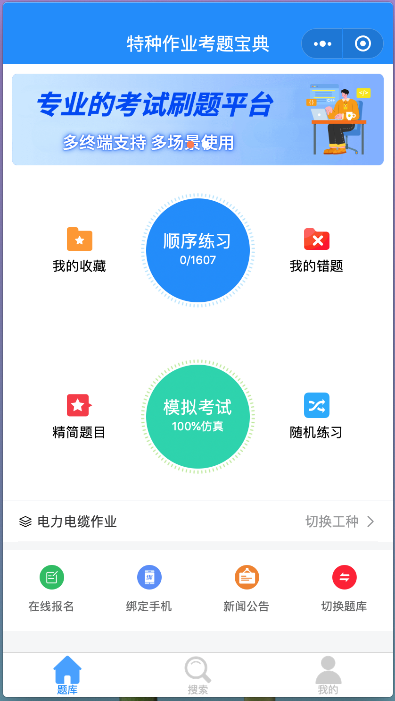
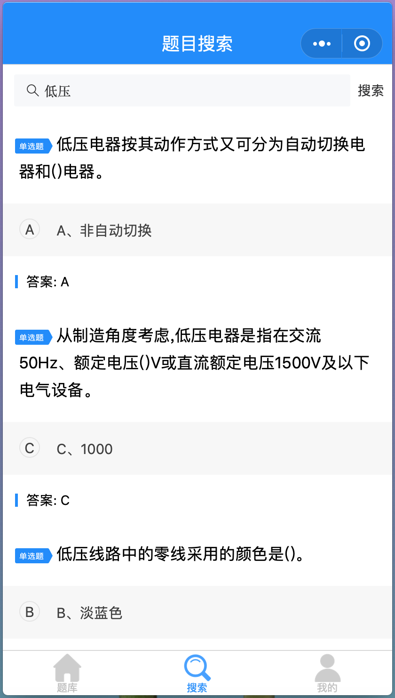
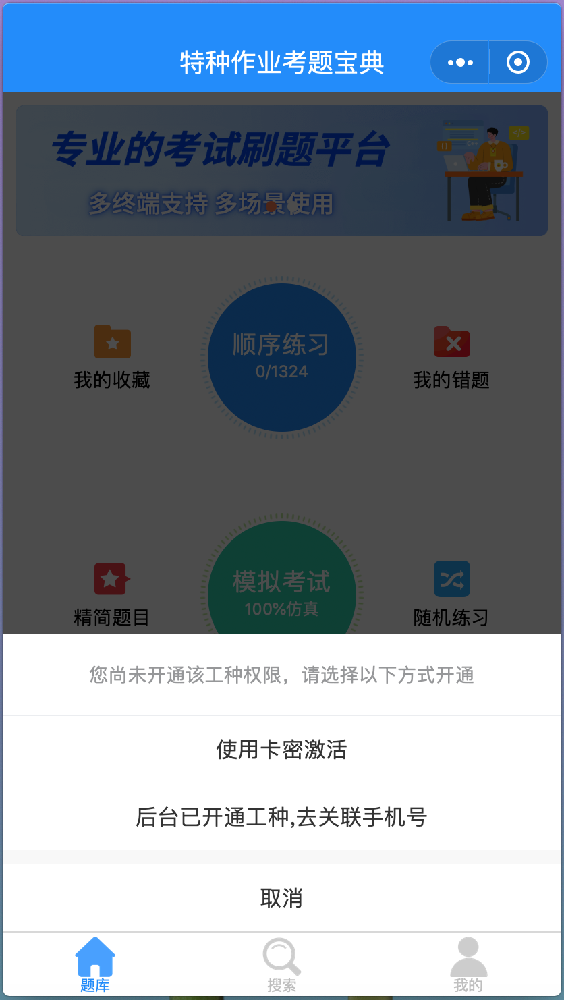

# 基于若依的在线刷题考试 微信小程序 支持电脑PC端刷题 手机端刷题  saas模式 一套题库支持多家机构分别使用

### 温馨提示：
******开源版暂无演示环境，请自行搭建看效果，以下为企业版演示环境及界面部分截图*********

### 访问官网
<a href="https://soft580.com" target="_blank">https://soft580.com   点击访问</a>
用户名:admin  密码:123456

#### 联系微信（动动您金贵的小手指，先给个Star鼓励一下奥，谢谢）

 

#### 联系QQ（动动您金贵的小手指，先给个Star鼓励一下奥，谢谢）（搜索：153768392）

#### 功能介绍

#### v3.4最新开发计划
      1.接入AI能力平台，实现智能答题和问题智能解答（计划中）；
      2.考试系统人脸（视频）采集、人脸识别等功能（计划中）；
 

#### v3.2最新版功能介绍
      1.新增考生报名、报名审核、班级、我的证书等功能；
	  
#### v3.1最新版功能介绍
      1.新增微信在线支付功能、正式组卷考试功能、考卷结果转PDF存档功能；
      
#### v3.0最新版功能介绍
      1.新增微信小程序端刷题功能，支持微信小程序+电脑端刷题需求，多端刷题记录实时同步；
      2.新增微信小程序端游客自行激活题库(通过授权码激活、微信在线支付激活敬请期待)；
      3.优化试题大并发加载速度，通过多种缓存方式解决试题试题加载及实时刷题速度；
      4.支持类SAAS模式，可开通子学校、子培训机构或子管理员，让其入驻使用；

#### 适用机构场景：
     在线考试系统适用于企业考核、员工职评测、培训机构考证刷题等场景；

#### 用户端功能：
     【网站首页信息】、【题库】、【在线支付开通科目】、【授权码激活开通科目】、【顺序练习】【随机练习】，【真题模拟】，【我的错题】，【我的收藏】、【视频课程】、【题目搜索】、【考试记录】、【我的证书】、【错题重练(答对自动移除错题)】、【收藏夹题目练习】、【解析查看】等等；

#### 后台功能：
                  一、 学员管理模块
                   1.1、学员管理【批量导入导出】、【开通课程】、【短信发送】、【培训记录】、【培训证书生成及打印】、【其他批量操作】
                   1.2、班级机构管理 
                   1.3、练习记录 
                   1.4、考试记录 
                   1.5、视频课程学习记录 

                  二、 题库管理
                   2.1、科目管理【出题规则设置】、【课程是否免费】、【收费价格设置】等
                   2.2、题库导入导出【单选、多选、判断】等
                   2.3、视频课程题库维护等

                  三、 卡密管理
                   3.1、卡密生成、卡密短信发送等

                  四、 订单交易
                   4.1、在线支付订单交易列表、交易明细等
 
                  五、 基础设置
                   5.1、网站首页管理（新闻、推荐、热门课程）
                   5.2、子管理员设置
                   5.3、角色设置
                   5.4、菜单设置
                   5.5、字典设置
                   5.6、参数设置
                   5.7、操作日志

                        ....
                   其他功能陆续完善中...

#### 运行环境

Java 1.8
Mysql 5.7+

#### 企业版学员小程序端效果图

小程序预览  

学员首页  

科目切换  

试题搜索  

我的页面  

在线激活科目  

在线报名  

#### 企业版学员PC前端效果图

学员首页 

学员首页 

开始练习 

顺序练习 

学员首页 

学员首页 

#### 企业版管理员后台管理端

管理员首页 

题库管理 

卡密管理 

子管理员设置 

